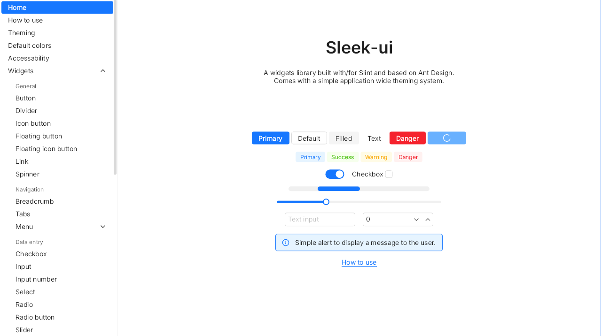

# SleekUI <!-- omit in toc -->
A UI components library built with/for [Slint](https://github.com/slint-ui/slint) based on [ant design](https://ant.design).  
<br />
<br />
<br />
<p align="center">
	
</p>
<br />
<br />
<br />

## Documentation
[Check out the interactive documentation.](https://uatomicboolean.github.io/SleekUI/)

## Installation
1. Download the library's archive from the latest release.
2. Unzip the archive and place the resulting `sleek-ui` wherever you want.
3. [Add a library path](https://docs.slint.dev/latest/docs/slint/guide/language/coding/file/#component-libraries) to use it with `@sleek-ui` in your slint code.

## How to use
Import the widgets from the `@sleek-ui/widgets.slint` file.  

```slint
import { UText, UButton } from "@sleek-ui/widgets.slint";

export component AppWindow inherits Window {
	width: 400px;
	height: 500px;
	in-out property <int> counter: 0;
	VerticalLayout {
		alignment: center;

		HorizontalLayout {
			alignment: center;
			UText {
				text: "Counter: \{counter}";
			}
		}

		HorizontalLayout {
			alignment: center;
			spacing: UAppTheme.spacing-base;
			UButton {
				variant: primary;
				text: "Decrement";
				clicked => {
					root.counter -= 1;
				}
			}

			UButton {
				text: "Reset";
				clicked => {
					root.counter = 0;
				}
			}

			UButton {
				variant: primary;
				danger: true;
				text: "increment";
				clicked => {
					root.counter += 1;
				}
			}
		}
	}
}
```

## Resources
- Ant Design Theme editor : https://ant.design/theme-editor
