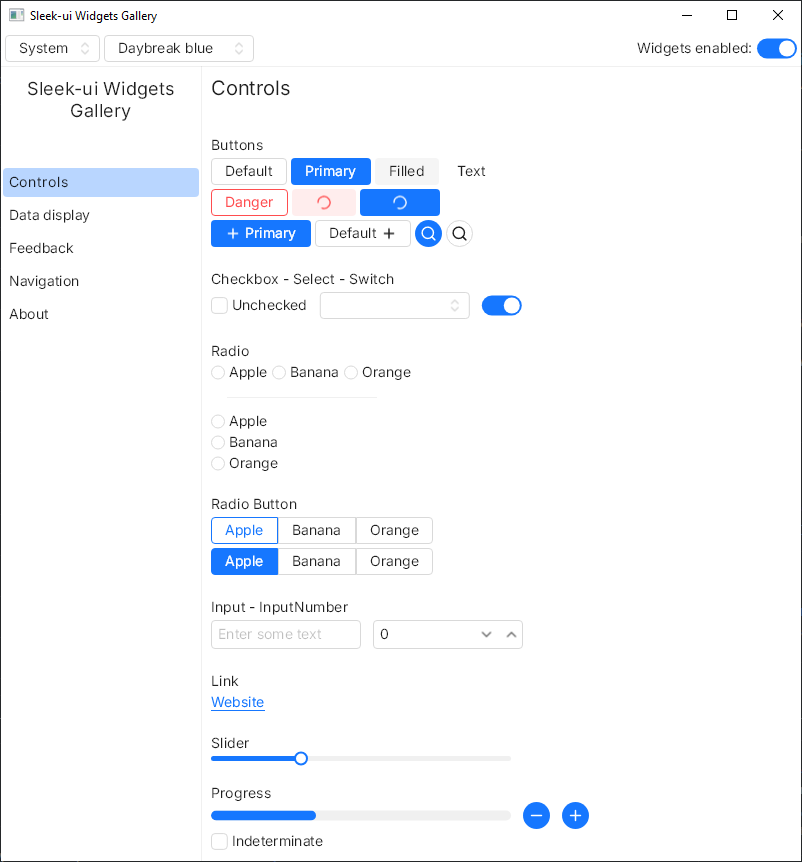

# sleek-ui <!-- omit in toc -->
A UI components library built with/for Slint based on [ant design](https://ant.design).  
<br />
<br />
<br />

<p align="center">
	
</p>
<br />
<br />
<br />

## Table of content <!-- omit in toc -->
- [Installation](#installation)
- [How to use](#how-to-use)
	- [Use the widgets](#use-the-widgets)
	- [Use the application's theme](#use-the-applications-theme)
		- [Use your own themes](#use-your-own-themes)
		- [Scale factor](#scale-factor)
- [Documentation](#documentation)
- [Widgets](#widgets)
	- [General](#general)
	- [Data entry](#data-entry)
	- [Data display](#data-display)
	- [Feedback](#feedback)
	- [Miscs](#miscs)
- [Resources](#resources)

## Installation
1. Download the library's archive from the latest release.
2. Unzip the archive and place the resulting `sleek-ui` wherever you want.
3. [Add a library path](https://docs.slint.dev/latest/docs/slint/guide/language/coding/file/#component-libraries) to use it with `@sleek-ui` in your slint code.

## How to use
### Use the widgets
Import the widgets from the `@sleek-ui/widgets.slint` file.  
Import the widgets' themes from the `@sleek-ui/widget-themes.slint` file.  

```slint
import { UText, UButton } from "@sleek-ui/widgets.slint";

export component AppWindow inherits Window {
	width: 400px;
	height: 500px;
	in-out property <int> counter: 0;
	VerticalLayout {
		alignment: center;

		HorizontalLayout {
			alignment: center;
			// Using the default theme.
			UText {
				text: "Counter: \{counter}";
			}
		}

		HorizontalLayout {
			alignment: center;
			spacing: 4px;
			// Using one of the premade theme.
			UButton {
				variant: primary;
				text: "Decrement";
				clicked => {
					root.counter -= 1;
				}
			}

			UButton {
				text: "Reset";
				clicked => {
					root.counter = 0;
				}
			}

			// Each button's theme has a danger variant.
			UButton {
				variant: primary;
				danger: true;
				text: "increment";
				clicked => {
					root.counter += 1;
				}
			}
		}
	}
}
```

### Use the application's theme
The application's theme is defined in the `@sleek-ui/app-theme.slint` file and implements by default: an automatic switch for dark and light themes, a customizable scale factor.  

#### Use your own themes
You can set your own color scheme themes by:
- updating the `ligth-theme` and `dark-theme` properties.
- updating the `theme` property but you will lose the automatic light/dark theme switch.

[Check the documentation for more informations](./docs-sleek-ui/theming.md).

#### Scale factor
Sleek-ui comes with a scale-factor integrated that allows you to increase or decrease all sizes.  
It takes effect in the `UAppTheme` global and all widgets.  
You can modify it in the backend whenever you want : 
```rust
let ui = AppWindow::new()?;

let app_theme_global = ui.global::<UAppTheme>();
app_theme_global.set_scale_factor(1.5);

ui.run()?;
```

## Documentation
The documentation is available in the [ui-docs](./docs-sleek-ui/) folder. You can also click on one of the widgets in the list below to go to its documentation.

Documentation pages :
- [Theming](docs-sleek-ui/theming.md)
- [Widgets documentation](docs-sleek-ui/widgets.md)

## Widgets
### General
- [x] Button
- [ ] ButtonGroup
- [x] Card
- [x] Divider
- [ ] Dropdown
- [x] FloatingButton
- [x] FloatingIconButton
- [x] Icon
- [x] IconButton
- [x] Typography

### Data entry
- [x] Checkbox
- [ ] DatePicker
- [x] Input
- [x] InputNumber
- [x] Radio
- [x] RadioButton
- [x] Select
- [ ] Slider
- [x] Switch
- [ ] TimePicker

### Data display
- [x] Collapse
- [x] Popover
- [ ] Tabs
- [x] Tag
- [ ] Tooltip

### Feedback
- [x] Modal
- [x] LinearProgress
- [ ] CircleProgress
- [x] Spinner
- [x] Alert
- [x] Notification

### Miscs
- [ ] Context menu
- [x] Breadcrumb

## Resources
- Ant Design Theme editor : https://ant.design/theme-editor
