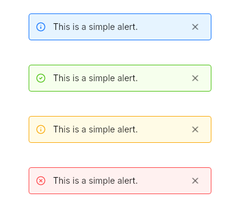

# Alert
A simple alert to display a message grabbing the user's attention.  



## Variants
- info
- success
- warning
- danger

## Properties, callbacks and functions
Inherits from `Rectangle`.  

**Properties:**
- message `<string>`

## Example
```slint
import { UAlert } from "@sleek-ui/widgets.slint";


export component AppWindow inherits Window {
	VerticalLayout {
		alignment: center;
		spacing: 8px;
		HorizontalLayout {
            alignment: center;
            UAlert {
                message: "This is a simple alert.";
            }
        }

        HorizontalLayout {
            alignment: center;
            UAlert {
                variant: success;
                message: "This is a simple alert.";
            }
        }

        HorizontalLayout {
            alignment: center;
            UAlert {
                variant: warning;
                message: "This is a simple alert.";
            }
        }

        HorizontalLayout {
            alignment: center;
            UAlert {
                variant: danger;
                message: "This is a simple alert.";
            }
        }
	}
}
```