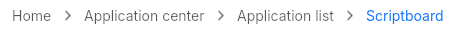

# Breadcrumb
A breadcrumd to display your current navigation level.  
All steps before last are clickable to manage navigation from the breadcrumb.  



## Theming properties
- t-spacing `<length>`: the spacing between the separator and the steps.
- t-icon-separator `<image>`
- t-separator-size `<length>`
- t-separator-color `<brush>`
- t-text-color `<brush>`
- t-font-size `<length>`
- t-font-weight `<int>`
- t-hover-text-color `<brush>`
- t-hover-font-weight `<int>`
- t-active-text-color `<brush>`
- t-active-font-weight `<int>`
  
## Properties, callbacks and functions
Inherits from `Rectangle`.  

**Properties:**  
- steps `<[string>]>`: a list of all the steps available.

**Callbacks:**  
- `step-clicked(step: string)`: called when a step is clicked with the clicked step as the argument.

## Example
```slint
import { UBreadcrumb } from "@sleek-ui/widgets.slint";


export component AppWindow inherits Window {
	VerticalLayout {
        alignment: center;
        spacing: 40px;
        HorizontalLayout {
            alignment: center;
            UBreadcrumb {
                steps: ["Home", "Application center", "Application list", "Scriptboard"];
                step-clicked(step) => {
                    debug(step)
                }
            }
        }
    }
}
```