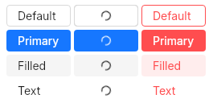

# Button
A simple button to do an action on click.  
When outside of a layout, the button will take all the space available, otherwise, it will fit to its content.  



## Variants
- default
- primary
- fill
- text

## Properties, callbacks and functions
Inherits from [ButtonInterface](./button-interface.md).  

**Properties:**
- text `<string>`: the text of the button.
- danger `<bool>`: set the button to a danger state using red colors.
- loading `<bool>`: display a spinner in the button and block all clicking interactions.
- checked `<bool>`: display the button as checked by modifying its appearance when not hovered/cliked/disabled.
- icon `<image>`: an icon to display in the button.
- colorize-icon `<bool>`: If set to true, the icon will be colorized to the same color as the button’s text color. Defaults to true.
- icon-placement `<IconTextPlacement>`: the icon's placement in the button. Can be `hidden`, `start` or `end` (`hidden` by default).

## Example
```slint
import { UButton } from "@sleek-ui/widgets.slint";

export component App inherits Window {
	VerticalLayout {
		alignment: center;
		HorizontalLayout {
			alignment: center;
			spacing: 4px;

			UButton {
				text: "Click me";
				clicked => {
					debug("Button clicked");
				}
			}

			UButton {
				variant: primary;
				text: "Click me";
			}

			UButton {
				variant: filled;
				text: "Click me";
				danger: true;
			}

			UButton {
				variant: text;
				text: "Click me";
				loading: true;
			}
		}
	}
}
```