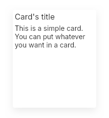

# Card
A simple elevated container to display data or build components.  
It accepts children using the `@children` expression.  



## Properties, callbacks and functions
Inherits from `Rectangle`.  

## Example
```slint
import { UCard, UTitle, UText } from "@sleek-ui/widgets.slint";


export component AppWindow inherits Window {
	VerticalLayout {
		alignment: center;
		spacing: 4px;
		HorizontalLayout {
			alignment: center;
			UCard {
				height: 200px;
				width: 170px;
				VerticalLayout {
					padding: 4px;
					HorizontalLayout {
						UTitle {
							text: "Card's title";
							level: 6;
						}
					}
					
					VerticalLayout {
						alignment: start;
						padding-top: 6px;
						UText {
							vertical-stretch: 1;
							text: "This is a simple card.";
						}
						UText {
							vertical-stretch: 1;
							text: "You can put whatever you want in a card.";
						}
					}
				}
			}
		}
	}
}
```