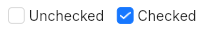

# Checkbox
A basic checkbox.  



## Properties, callbacks and functions
Inherits from [ButtonInterface](./button-interface.md).  

**Properties:**
- checked `<bool>`
- text `<string>`
- text-placement `<IconTextPlacement>`: one of `start`, `end`, `hidden`. Defaults to `start`.

## Example
```slint
import { UCheckbox } from "@sleek-ui/widgets.slint";


export component AppWindow inherits Window {
	VerticalLayout {
		alignment: center;
		spacing: 8px;
		HorizontalLayout {
            alignment: center;
			spacing: 4px;
            UCheckbox {
				checked: true;
				text: "Checkbox";
			}

			UCheckbox {
				checked: false;
				text: "Checkbox";
				text-placement: end;
			}
        }
	}
}
```