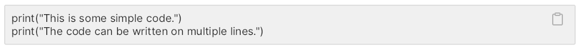

# Code
A simple widget to display some text as code.  
A clipboard button is available, when enabled, in the top-right corner of the code area.  

> [!NOTE]
> Please note that you need to add the logic for the clipboard in your code.



## Properties, callbacks and functions
Inherits from `Rectangle`.  

**Properties:**
- code `<string>`: the code to display.
- enable-clipboard `<bool>`: weither to display or not the clipboard icon. Defaults to false.

**Callbacks:**
- `copied(code: string)`: fired when the clipboard icon is clicked.

## Example
```slint
import { UCode } from "@sleek-ui/widgets.slint";


export component AppWindow inherits Window {
	VerticalLayout {
		alignment: center;
		spacing: 8px;
		HorizontalLayout {
            UCode {
				code: "print(\"This is some simple code.\")\nprint(\"The code can be written on multiple lines.\")";
			}
        }

        HorizontalLayout {
            UCode {
				enabled-clipboard: true;
				code: "print(\"This is some simple code.\")\nprint(\"The code can be written on multiple lines.\")";
			}
        }
	}
}
```