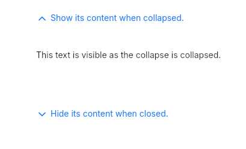

# Collapse
A container that hide or show its children when clicked.  



## Theming properties
- t-background `<brush>`
- t-text-color `<brush>`
- t-font-size `<length>`
- t-font-weight `<int>`
- t-icon-size `<length>`
- t-icon-color `<brush>`
  
## Properties, callbacks and functions
Inherits from [ButtonInterface](./button-interface.md).  

**Properties:**
- title `<string>`
- collapse-open `<bool>`
- content-width `<length>`: define the content's width inside the collapse.
- content-height `<length>`: same as above but for the height.

## Example
```slint
import { UCollapse, UText } from "@sleek-ui/widgets.slint";


export component AppWindow inherits Window {
	VerticalLayout {
		alignment: center;
		spacing: 8px;
		HorizontalLayout {
            alignment: center;
			spacing: 4px;
            UCollapse {
                title: "A basic collapse";
				content-width: 300px;
                UText {
                    text: "This text is visible only when collapse-open is true.";
                }
            }
        }
	}
}
```