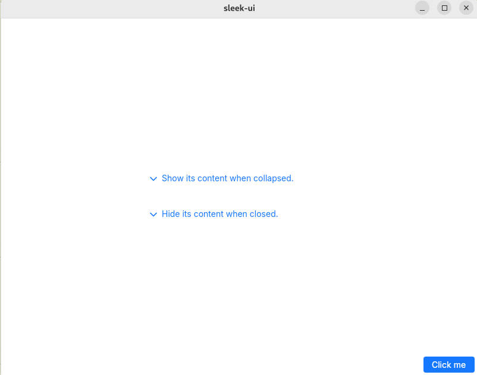

# FloatingButton
A UButton encapsuled in a VerticalLayout and an HorizontalLayout that can be placed wherever you want in a container.  
You can position the floating button with either:
- the `x` and `y` properties.
- the `vertical-alignement` and `horizontal-alignement` properties used with the `layout-padding-*` properties.



## Variants
Uses [UButton's](button.md) variants.

## Properties, callbacks and functions
This widget uses the properties, callbacks and functions of [UButton](button.md)

**Properties:**
- vertical-alignment `<LayoutAlignment>`
- horizontal-alignment `<LayoutAlignment>`
- layout-padding-top `<length>`
- layout-padding-bottom `<length>`
- layout-padding-left `<length>`
- layout-padding-right `<length>`

## Example
```slint
import { UFloatingButton, UText } from "@sleek-ui/widgets.slint";


export component AppWindow inherits Window {
	width: 500px;
	height: 400px;
	VerticalLayout {
		alignment: center;
		UText {
			text: "The content in your window";
		}
	}

	// Position the button using the layout properties.
	UFloatingButton {
        vertical-alignment: end;
        horizontal-alignment: end;
		layout-padding-bottom: 4px;
		layout-padding-right: 4px;
		text: "Click me";
		clicked => {
			debug("Button clicked")
		}
	}

	// Or use the x and y properties.
	UFloatingButton {
		x: 450px;
		y: 370px;
		text: "Click me";
		clicked => {
			debug("Button clicked")
		}
	}
}
```