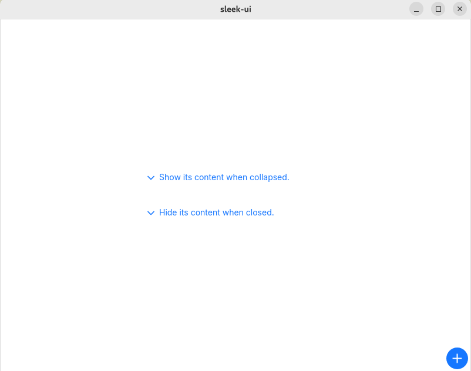

# FloatingIconButton
This button works exactly like the [UFloatingButton](floating-button.md).  



## Themes
This widget uses the themes of [UIconButton](button.md).

## Properties, callbacks and functions
This widget uses the properties, callbacks and functions of [UIconButton](button.md)

**Properties:**
- vertical-alignment `<LayoutAlignment>`
- horizontal-alignment `<LayoutAlignment>`
- layout-padding-top `<length>`
- layout-padding-bottom `<length>`
- layout-padding-left `<length>`
- layout-padding-right `<length>`

## Example
```slint
import { UFloatingIconButton, UText } from "@sleek-ui/widgets.slint";


export component AppWindow inherits Window {
	width: 500px;
	height: 400px;
	VerticalLayout {
		alignment: center;
		UText {
			text: "The content in your window";
		}
	}

	// Position the button using the layout properties.
	UFloatingIconButton {
        vertical-alignment: end;
        horizontal-alignment: end;
		layout-padding-bottom: 4px;
		layout-padding-right: 4px;
		icon: @image-url("assets/images/plus.svg");
		clicked => {
			debug("Button clicked")
		}
	}

	// Or use the x and y properties.
	UFloatingIconButton {
		x: 450px;
		y: 370px;
		icon: @image-url("assets/images/plus.svg");
		clicked => {
			debug("Button clicked")
		}
	}
}
```