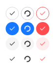

# IconButton
A simple icon button to do an action on click.  
When outside of a layout, the button will take all the space available, otherwise, it will fit to its content.  



## Variants
- default
- primary
- fill
- text
- text-raw: a simple theme with no effect except changing the text color on hover.
- custom: used to implement custom themes.

## Theming properties
The theming for `UIconButton` is particular as it uses a struct to define the colors.  
This allows easier management of the `danger` and regular states.

Here are the fields in the `UIconButtonThemeColors` struct:
- background `<brush>`
- background-hover `<brush>`
- background-active `<brush>`
- background-checked `<brush>`
- background-disabled `<brush>`
- text-color `<brush>`
- text-color-hover `<brush>`
- text-color-active `<brush>`
- text-color-checked `<brush>`
- text-color-disabled `<brush>`
- border `<brush>`
- border-hover `<brush>`
- border-active `<brush>`
- border-checked `<brush>`
- border-disabled `<brush>`

Here are the theming properties at the top level of `UIconButton`:
- t-icon-size `<length>`: please check the [comments in the code](../../ui/sleek-ui/widgets/icon-button.slint) to know about the `UButton` text size problem that impacts this icon size.
- t-border-width `<length>`
- t-border-radius `<length>`
- t-padding-vertical `<length>`
- t-padding-horizontal `<length>`
- t-base-colors `<UIconButtonThemeColors>`: colors used when the button is in its regular state.
- t-danger-colors `<UIconButtonThemeColors>`: colors used for the `danger` state.

## Properties, callbacks and functions
Inherits from [ButtonInterface](./button-interface.md).  

**Properties:**
- danger `<bool>`: set the button to a danger state using red colors.
- loading `<bool>`: display a spinner in the button and block all clicking interactions.
- checked `<bool>`: display the button as checked by modifying its appearance when not hovered/cliked/disabled.
- icon `<image>`: an icon to display in the button.
- icon-size `<length>`

## Example
```slint
import { UIconButton } from "@sleek-ui/widgets.slint";

export component App inherits Window {
	VerticalLayout {
		alignment: center;
		HorizontalLayout {
			alignment: center;
			spacing: 4px;

			UIconButton {
				text: "Click me";
				clicked => {
					debug("Button clicked");
				}
			}

			UIconButton {
				variant: primary;
				text: "Click me";
			}

			UIconButton {
				variant: filled;
				text: "Click me";
				danger: true;
			}

			UIconButton {
				variant: text;
				text: "Click me";
				loading: true;
			}
		}
	}
}
```