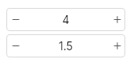

# InputNumber
An input, also known as spinbox, made only for numerical values.  
You should always set the width of the input when using it.  



## Themes
This widget uses the themes of [UInput](input.md).

## Properties, callbacks and functions
Inherits from `Rectangle`.  
All the properties, callbacks and functions from `TextInput` are available on this widget.  

**Properties:**
- value `<float>`: the current value of the input
- enabled `<bool>`: is the input enabled
- step `<float>`: how much to increment/decrement when using the buttons. Default to `1`.
- number `<bool>`: if true then the input is of type `number`, else `decimal`. Default to `false`.
- error `<bool>`: Set the input in error status.
- enable-min-max `<bool>`: if set to true, then the min/max boundaries are working.
- min-value `<float>`: the min boundary. Default to `-100`.
- max-value `<float>`: the max boundary. Default to `100`.

## Example
```slint
import { UInputNumber } from "@sleek-ui/widgets.slint";

export component App inherits Window {
	VerticalLayout {
		alignment: center;
		HorizontalLayout {
			alignment: center;
			spacing: 4px;

			UInputNumber {
				width: 150px;
			}
		}
	}
}
```