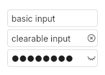

# Input
a text input that can be used as a password input.  
It can be used as a numerical input to when setting the `input-type` property to `number` or `decimal`.  
Please note that the `clearable` property cannot be used when `input-type` is set to `password`.
**Warning:** the password input is currently visually bugged.  



## Themes
- default

**Theming struct:**
```slint
struct UInputTheme {
	background: brush,
	background-active: brush,
	background-error: brush,
	background-disabled: brush,
	border-width: length,
	border-radius: length,
	border-color: brush,
	border-color-error: brush,
	border-color-active: brush,
	border-color-disabled: brush,
	text-color: brush,
	text-color-disabled: brush,
	font-size: length,
	font-weight: int,
	placeholder-color: brush,
	icon-size: length,
	icon-color: brush,
	padding-vertical: length,
	padding-horizontal: length,
}
```

## Properties, callbacks and functions
Inherits from `Rectangle`.  
All the properties, callbacks and functions from `TextInput` are available on this widget.  

**Properties:**
- text `<string>`: the current value of the input
- enabled `<bool>`: is the input enabled
- error `<bool>`: Set the input in error status.
- input-type `<InputType>`: the type of the text input.
- placeholder `<string>`: a string to display in the input when the input is empty.
- clearable `<bool>`: if true, display a button that empty the input when clicked.
- show `<bool>`: only used when `input-type` is of type `password`. Display or not the content of the password input.

## Example
```slint
import { UInput } from "@sleek-ui/widgets.slint";

export component App inherits Window {
	VerticalLayout {
		alignment: center;
		HorizontalLayout {
			alignment: center;
			spacing: 4px;

			HorizontalLayout {
            alignment: center;
            spacing: 4px;
				UInput {
					width: 150px;
				}
			}

			HorizontalLayout {
				alignment: center;
				spacing: 4px;
				UInput {
					width: 150px;
					clearable: true;
				}
			}

			HorizontalLayout {
				alignment: center;
				spacing: 4px;
				UInput {
					width: 150px;
					input-type: password;
				}
			}
		}
	}
}
```