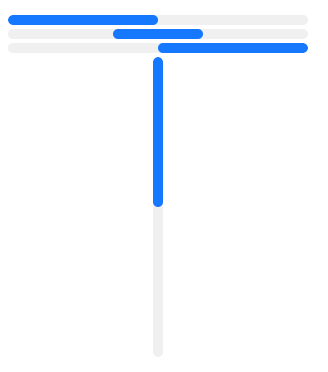

# LinearProgress
A vertical or horizontal Progress display.  



## Variants
- primary
- success
- warning
- danger
- base: used to implement custom themes.

## Theming properties
- t-progress-color `<brush>`
- t-background `<brush>`
- t-default-size `<length>`: the default thickness of the progress bar. Defaults to `10px`.
- t-radius `<length>`

## Properties, callbacks and functions
Inherits from `Rectangle`.  

**Properties:**  
- orientation `<Orientation>`: define if the progress is horizontal or vertical.
- alignment `<ProgressAlignment>`: define if the progress starts from the start or the end.
- progress `<percent>`: the current progress of the widget.
- indeterminate `<bool>`: if true, then the progress will be locked at 30% and will display a loading state.

## Example
```slint
import { UProgress } from "@sleek-ui/widgets.slint";

export component App inherits Window {
	VerticalLayout {
		alignment: center;
		spacing: 4px;
		HorizontalLayout {
            alignment: center;
            spacing: 4px;
            UProgress {
                width: 300px;
                progress: 50%;
            }
        }

        HorizontalLayout {
            alignment: center;
            spacing: 4px;
            UProgress {
				variant: success;
                width: 300px;
                indeterminate: true;
            }
        }

        HorizontalLayout {
            alignment: center;
            spacing: 4px;
            UProgress {
				variant: warning;
                width: 300px;
                alignment: end;
                progress: 50%;
            }
        }

        HorizontalLayout {
            alignment: center;
            spacing: 4px;
            UProgress {
				variant: danger;
                height: 300px;
                orientation: vertical;
                progress: 50%;
            }
        }
	}
}
```