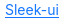

# Link
Text represented as a link with an underline.  
Please note that you need to implement the link's logic in your code as Slint can't open a link by itself.  



## Themes
- primary

**Theming struct:**
```slint
struct ULinkTheme {
	font-size: length,
	text-color: brush,
	text-color-hover: brush,
	text-color-active: brush,
	underline-spacing: length,
	underline-thickness: length,
}
```

## Properties, callbacks and functions
Inherits from [ButtonInterface](./button-interface.md).  

**Properties:**
- text `<string>`

## Example
```slint
import { ULink } from "@sleek-ui/widgets.slint";

export component App inherits Window {
	VerticalLayout {
		alignment: center;
		HorizontalLayout {
			alignment: center;
			spacing: 4px;
			ULink {
				text: "Sleek-ui";
				clicked => {
					debug("Open link");
				}
			}
		}
	}
}
```