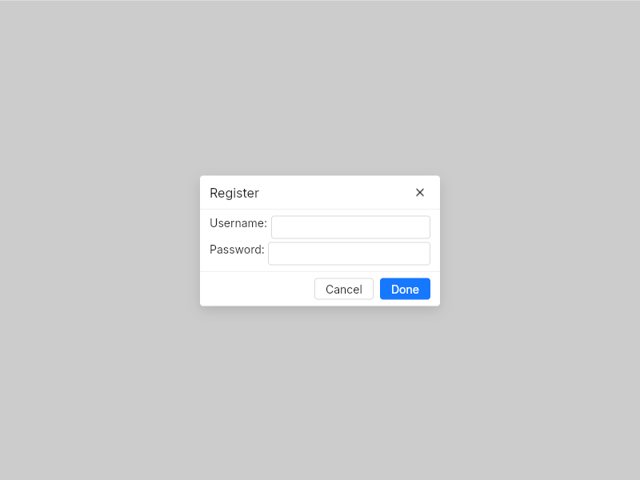

# Modal
Display a modal dialog box, providing a title, content area, and action buttons.    



## Theming properties
- t-blurred-background-color `<brush>`: defaults to `rgba(0, 0, 0, 0.2)`.
- t-title-horizontal-padding `<length>`
- t-title-vertical-padding `<length>`
- t-content-horizontal-padding `<length>`
- t-content-vertical-padding `<length>`
- t-buttons-horizontal-padding `<length>`
- t-buttons-vertical-padding `<length>`
- t-buttons-spacing `<length>`
- t-title-level `<int>`: defaults to `6`.
- t-title-font-weight `<int>`: defaults to `600`.
- t-close-button-variant `<UIconButtonVariant>`: defaults to `text`.
- t-cancel-button-variant `<UButtonVariant>`: defaults to `default`.
- t-accept-button-variant `<UButtonVariant>`: defaults to `primary`.
- t-modal-min-width `<length>`: defaults to `300px`.
- t-modal-min-height `<length>`: no default value.
- t-modal-max-width `<length>`: defaults to `600px`.
- t-modal-max-height `<length>`: defaults to `600px`.
- t-border-radius `<length>`: the radius of the modal's card. defaults to `UAppTheme.radius-base`.
- t-display-top-divider `<bool>`: display or not the divider separating the title area from the content. Defaults to `false`.
- t-display-bottom-divider `<bool>`: display or not the divider separating the content area from the bottom buttons. Defaults to `false`.

## Properties, callbacks and functions
**Properties:**
- title `<string>`: the modal's title, display in its header.
- accept-btn-text `<string>`: the text displayed in the accept button. Defaults to "Done".
- cancel-btn-text `<string>`: the text displayed in the cancel button. Defaults to "Cancel".
- accept-btn-danger `<bool>`: define if the button is in the `danger` state. Defaults to false.
- cancel-btn-danger `<bool>`: define if the button is in the `danger` state. Defaults to false.
- accept-btn-toggle `<bool>`: allow to display or not the accept button. Defaults to true.
- cancel-btn-toggle `<bool>`: allow to display or not the cancel button. Defaults to true.
- close-on-click-outside `<bool>`: if true, the modal will be closed when clicking on its greyed background. Defaults to false.
- close-on-accept `<bool>`: weither to close or not the modal when clicking on the accept button. Defaults to true.
- close-on-cancel `<bool>`: weither to close or not the modal when clicking on the cancel button. Defaults to true.
- accept-btn-enabled `<bool>`: enable or disable the accept button. Defaults to true.
- cancel-btn-enabled `<bool>`: enable or disable the cancel button. Defaults to true.

**Callbacks:**
- `showed`: called when the modal is opened/showed.
- `closed`: called when the modal is closed.
- `accepted`: called when the accept button is clicked.
- `rejected`: called when the cancel button is clicked.

**Functions:**
- `show`: show the modal.
- `close`: close the modal.

## Example
```slint
import { UButton, UInput, UModal, UText } from "@sleek-ui/widgets.slint";


export component AppWindow inherits Window {
	
    VerticalLayout {
        alignment: center;
        HorizontalLayout {
            alignment: center;
            UButton {
                text: "Open modal";
                clicked => {
                    modal.show();
                }
            }
        }
    }

    modal := UModal {
        title: "Register";

        VerticalLayout {
            spacing: 4px;
            HorizontalLayout {
                spacing: 4px;
                UText {
                    text: "Username:";
                }

                UInput {
                    horizontal-stretch: 1;
                }
            }

            HorizontalLayout {
                spacing: 4px;
                UText {
                    text: "Password:";
                }

                UInput {
                    horizontal-stretch: 1;
                }
            }
        }
    }
}
```