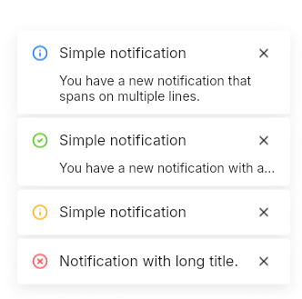

# Notification
A notification that can be dynamicaly displayed in the application's window.  
It can a title, a message, or both, and is interactive.  
As `UNotification` inherits from `ButtonInterface`, you can execute actions when it is clicked.  



## Variants
- info
- success
- warning
- danger
- custom: used to implement custom themes.

## Theming properties
- t-icon-image `<image>`
- t-icon-color `<brush>`
- t-icon-size: `<length>`
- t-title-font-size `<length>`
- t-title-horizontal-padding `<length>`
- t-title-vertical-padding `<length>`
- t-content-padding-top `<length>`
- t-content-padding-bottom `<length>`
- t-content-padding-left `<length>`
- t-content-padding-right `<length>`
- t-background `<brush>`
- t-border-radius `<length>`
- t-border-width `<length>`
- t-border-color `<brush>`
- t-drop-shadow-blur `<length>`
- t-drop-shadow-color `<color>`
- t-drop-shadow-offset-y `<length>`
- t-close-button-variant `<UIconButtonVariant>`

## Properties, callbacks and functions
Inherits from `ButtonInterface`.  

**Properties:**  
- title `<string>`: the notification's title. It elides if too long.
- message `<string>`: the notification's message. It will word-wrap if `single-line-message` is false.
- single-line-message `<bool>`: (true by default) the notification's message will elide on the first line if set to true.  

**Callbacks:**  
- `close()`: called when the close button is clicked.

## Example
```slint
import { UNotification } from "@sleek-ui/widgets.slint";

export component App inherits Window {
	VerticalLayout {
		alignment: center;
		spacing: 4px;
		HorizontalLayout {
            alignment: center;
            spacing: 4px;
            UNotification {
                width: 300px;
                single-line-message: false;
                title: "Simple notification";
                message: "You have a new notification that spans on multiple lines.";
            }
        }

        HorizontalLayout {
            alignment: center;
            spacing: 4px;
            UNotification {
                variant: success;
                width: 300px;
                title: "Simple notification";
                message: "You have a new notification with a single line message that must be read.";
            }
        }

        HorizontalLayout {
            alignment: center;
            spacing: 4px;
            UNotification {
                variant: warning;
                width: 300px;
                title: "Simple notification";
            }
        }

        HorizontalLayout {
            alignment: center;
            spacing: 4px;
            UNotification {
                variant: danger;
                width: 300px;
                title: "Notification with long title.";
            }
        }
	}
}
```