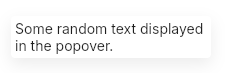

# Popover
A custom `PopupWindow` to display some content above the window.  
A Popover content is displayed inside a `UCard`.  
You can check `USelect` that uses it to display the choices.  



## Theming properties
Uses `UCard` properties as it is its direct child:
- t-background `<brush>`
- t-border-radius `<length>`
- t-drop-shadow-blur `<length>`
- t-drop-shadow-color `<color>`
- t-drop-shadow-offset-y `<length>`

## Properties, callbacks and functions
Inherits from `PopupWindow`.   

## Example
```slint
import { UPopover, UText } from "@sleek-ui/widgets.slint";

export component App inherits Window {
	VerticalLayout {
		alignment: center;
		spacing: 4px;
		HorizontalLayout {
            alignment: center;
            spacing: 4px;
            popover := UPopover {
				UText {
					text: "Some random text display in the popover.";
				}
            }
        }
	}

	touch := TouchArea {
		clicked => {
			popover.show();
		}
	}
}
```