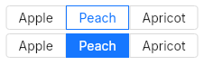

# RadioButton
An alternative to the [URadio](radio.md) widget with a button look and feel.  
Like a radio, only one option can be selected.  



## Variants
- default
- primary

## Properties, callbacks and functions
Inherits from `Rectangle`.

**Properties:**
- enabled `<bool>`: enable or not the widget. Defaults to `true`.
- selected-value `<string>`: the current selected value.
- options `<[string]>`: the list of available values.

**Callbacks:**
- `selected(value: string)`: called when the selected value changed.

## Example
```slint
import { URadioButton } from "@sleek-ui/widgets.slint";

export component App inherits Window {
	VerticalLayout {
		alignment: center;
		spacing: 4px;
		HorizontalLayout {
			alignment: center;
			spacing: 4px;
            URadioButton {
                selected-value: "Shenzou";
                options: ["Shangai", "Shenzou", "Hong Kong"];
            }
		}

		HorizontalLayout {
			alignment: center;
			spacing: 4px;
            URadioButton {
				variant: primary;
                selected-value: "Shenzou";
                options: ["Shangai", "Shenzou", "Hong Kong"];
            }
		}
	}
}
```