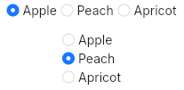

# RadioButton
A group of radio choices.  



## Properties, callbacks and functions
Inherits from `Rectangle`.

**Properties:**
- enabled `<bool>`: enable or not the widget. Defaults to `true`.
- vertical `<bool>`: indicates weither the radio group should be vertical or horizontal. Defaults to `true`.
- options `<[string]>`: the list of available values.
- selected-value `<string>`: the currently selected value.

**Callbacks:**
- `selected(value: string)`: called when the selected value changed.

## Example
```slint
import { UHorizontalRadio, UVerticalRadio } from "@sleek-ui/widgets.slint";

export component App inherits Window {
	VerticalLayout {
		alignment: center;
		spacing: 4px;
		HorizontalLayout {
            alignment: center;
            spacing: 4px;
            UHorizontalRadio {
                selected-value: "Shenzou";
                options: ["Shangai", "Shenzou", "Hong Kong"];
            }
        }

        HorizontalLayout {
            alignment: center;
            spacing: 4px;
            UVerticalRadio {
                selected-value: "Shenzou";
                options: ["Shangai", "Shenzou", "Hong Kong"];
            }
        }
	}
}
```