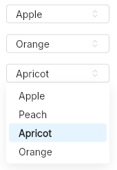

# Select
A widget to chose a value from a selection with a dropdown.  
It is possible to disable an option in the select (this can be used as a separator).



> [!WARNING]
> It is highly recommended to define the `t-option-height`.
> Otherwise, the options' height might change depending on the number of options.
> This leads to some wrong height calculations for the ScrollView viewport.

## Properties, callbacks and functions
Inherits from `ButtonInterface`.   

**Properties:**
- current-index `<int>`: the current selected index. Set this to -1 to have no selected option (-1 by default).
- options `<[{text: string, value: string, enabled: bool}]>`: the list of available options in the select.

## Example
```slint
import { USpinner } from "@sleek-ui/widgets.slint";

export component App inherits Window {
	VerticalLayout {
		alignment: center;
		spacing: 4px;
		HorizontalLayout {
			alignment: center;
			spacing: 4px;
            USelect {
                width: 150px;
                options: [
                    { text: "Apple", value: "apple", enabled: true },
                    { text: "Peach", value: "peach", enabled: true },
                    { text: "Apricot", value: "apricot", enabled: true },
                    { text: "Orange", value: "orange", enabled: true },
                ];
            }
		}
	}
}
```