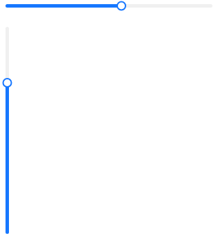

# Slider
A widget to select a value in a defined range.  
The slider can be manipulated with the arrows keys when focused:
- right arrow: increase by 1 step.
- left arrow: decrease by 1 step.
- up arrow: set to maximum value.
- down arrow: set to minimum value.



## Properties, callbacks and functions
Inherits from `ButtonInterface`.  

**Properties:**
- value `<float>`: defaults to `0`.
- step `<float>`: defaults to `1`.
- min-value `<float>`: defaults to `0`.
- max-value `<float>`: defaults to `100`.
- orientation `<Orientation>`: defaults to `horizontal`.
- default-size `<length>`: the default height if the orientation is `horizontal`, else the default width. Defaults to `5px`.

## Example
```slint
import { USlider } from "@sleek-ui/widgets.slint";


export component AppWindow inherits Window {
	VerticalLayout {
		alignment: center;
		HorizontalLayout {
            alignment: center;
            USlider {
                    value: 10;
                    step: 5;
                    height: 300px * UAppTheme.scale-factor;
            }
        }
	}
}
```