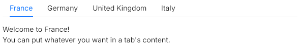

# Tabs
A navigation widgets to switch between tabs.



## Properties, callbacks and functions
Inherits from `Rectangle`.  

**Properties:**
- tabs `<[string]>`: the list of the available tabs.
- current-index `<int>`: the index of the currently selected tab.

## Example
```slint
import { UTabs } from "@sleek-ui/widgets.slint";


export component AppWindow inherits Window {
	VerticalLayout {
		alignment: start;
		UTabs {
			tabs: ["France", "Germany", "United Kingdom", "Italy"];
			if self.current-index == 0: VerticalLayout {
				spacing: UAppTheme.spacing-base;
				UText {
					text: "Welcome to France!";
				}

				UText {
					text: "You can put whatever you want in a tab's content.";
				}
			}
			if self.current-index == 1: UText {
				text: "Welcome to Germany!";
			}
			if self.current-index == 2: UText {
				text: "Welcome to the United Kingdom!";
			}
			if self.current-index == 3: UText {
				text: "Welcome to Italy!";
			}
		}
	}
}
```