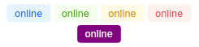

# Tag
A simple tag.  
You can either use one of the theme or set your own colors using `text-color` and `background-color`.



## Themes
- primary
- danger
- warning
- success

**Theming struct:**
```slint
struct UTagTheme {
	background: brush,
	text-size: length,
	text-color: brush,
	icon-size: length,
	border-width: length,
	border-color: brush,
	border-radius: length,
	padding-vertical: length,
	padding-horizontal: length,
	content-spacing: length,
}
```

## Properties, callbacks and functions
Inherits from `Rectangle`.   

**Properties:**
- text `<string>`
- text-color `<color>`
- background-color `<color>`
- icon `<image>`
- icon-placement `<IconTextPlacement>`: can be `start`, `end` or `hidden`. Default to `hidden`.

## Example
```slint
import { UTag } from "@sleek-ui/widgets.slint";
import { UTagThemes } from "@sleek-ui/widget-themes.slint";

export component App inherits Window {
	VerticalLayout {
		alignment: center;
		spacing: 4px;
		HorizontalLayout {
			alignment: center;
			spacing: 4px;
			UTag {
				text: "online";
				theme: UTagThemes.primary;
			}

			UTag {
				text: "online";
				theme: UTagThemes.success;
			}

			UTag {
				text: "online";
				theme: UTagThemes.warning;
			}

			UTag {
				text: "online";
				theme: UTagThemes.danger;
			}
		}

		HorizontalLayout {
			alignment: center;
			spacing: 4px;
			// With custom colors.
			UTag {
				text: "online";
				text-color: white;
				background-color: purple;
			}
		}
	}
}
```