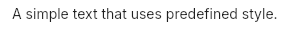

# Text
A `Text` widget with predefined properties values.  



## Theming properties
This widgets doesn't have any theming properties as it directly inherits from `Text`.  
However, the `color` and `font-size` are set to custom values:
- color: `UAppTheme.text`
- font-size: `UAppTheme.font-size-base`

## Properties, callbacks and functions
Inherits from `Text`.   

## Example
```slint
import { UText } from "@sleek-ui/widgets.slint";

export component App inherits Window {
	VerticalLayout {
		alignment: center;
		spacing: 4px;
		HorizontalLayout {
			alignment: center;
			spacing: 4px;
            UText {
                text: "A simple text that uses predefined style.";
            }
		}
	}
}
```