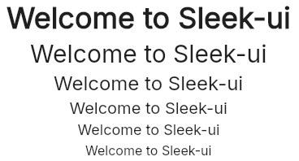

# Title
A `Text` widget with predefined theme to display a title.  
Its theme implement almost all of the properties of `Text`, allowing you to create themes for any situations.  



## Themes
- level-1
- level-2
- level-3
- level-4
- level-5
- level-6

**Theming struct:**
```slint
struct UTitleTheme {
	color: brush,
	font-size: length,
	font-weight: int,
	font-family: string,
	font-italic: bool,
	horizontal-alignment: TextHorizontalAlignment,
	letter-spacing: length,
	overflow: TextOverflow,
	vertical-alignment: TextVerticalAlignment,
	wrap: TextWrap,
	stroke: brush,
	stroke-width: length,
	stroke-style: TextStrokeStyle,
}
```

## Properties, callbacks and functions
Inherits from `Text`.   

## Example
```slint
import { UTitle } from "@sleek-ui/widgets.slint";
import { UTitleThemes } from "@sleek-ui/widget-themes.slint";

export component App inherits Window {
	VerticalLayout {
		alignment: center;
		spacing: 4px;
		HorizontalLayout {
            alignment: center;
            spacing: 4px;
            UTitle {
                text: "Welcome to Sleek-ui";
                theme: UTitleThemes.level-1;
            }
        }

        HorizontalLayout {
            alignment: center;
            UTitle {
                text: "Welcome to Sleek-ui";
                theme: UTitleThemes.level-2;
            }
        }

        HorizontalLayout {
            alignment: center;
            UTitle {
                text: "Welcome to Sleek-ui";
                theme: UTitleThemes.level-3;
            }
        }

        HorizontalLayout {
            alignment: center;
            UTitle {
                text: "Welcome to Sleek-ui";
                theme: UTitleThemes.level-4;
            }
        }

        HorizontalLayout {
            alignment: center;
            UTitle {
                text: "Welcome to Sleek-ui";
                theme: UTitleThemes.level-5;
            }
        }

        HorizontalLayout {
            alignment: center;
            UTitle {
                text: "Welcome to Sleek-ui";
                theme: UTitleThemes.level-6;
            }
        }
	}
}
```