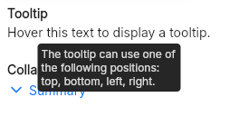

# Tooltip
A widget to display a tooltip when hovering an element.  
It can use the following positions: top, bottom, left, right.  

When used, you must specify the x and y coordinates of the top-left corner of your target element and its width and height.  
The x and y coordinates might some adjustements using the absolute position.  
Exemple:
```slint
inner-x: target.absolute-position.x - root.absolute-position.x;
inner-y: target.absolute-position.y;
inner-width: target.width;
inner-height: target.height;
``` 




> [!NOTE]
> You must place the tooltip at the end of the window/page or else the tooltip will be hidden by the following elements.  
> Moreover, if placed inside a page while using a sidebar as a example, the tooltip can still go under the sidebar depending on how you implemented it.
> This is due to the fact that the `z` index only works on the siblings elements.

## Properties, callbacks and functions

**Properties:**
- text `<string>`
- position `<TooltipPosition>`: can be `top`, `bottom`, `left` or `right`. Defaults to `top`.
- delay `<duration>`: the delay before displaying the tooltip when hovering the target element.
- user_is_hovering `<bool>`: must be set t
- inner-x `<length>`:
- inner-y `<length>`:
- inner-width `<length>`:
- inner-height `<length>`:
- has_waited `<bool>`:

## Example
```slint
import { UTooltip } from "@sleek-ui/widgets.slint";

export component App inherits Window {
	VerticalLayout {
		alignment: center;
		spacing: 4px;
		HorizontalLayout {
			alignment: center;
			spacing: 4px;
			t-text := TouchArea {
				UText {
					text: "Hover this text to display a tooltip.";
				}
			}
		}
	}

	UTooltip {
		text: "Here is a tooltip.";
		position: top;
		user_is_hovering: t-text.has-hover;
		inner-x: t-text.absolute-position.x - root.absolute-position.x;
		inner-y: t-text.absolute-position.y;
		inner-width: t-text.width;
		inner-height: t-text.height;
	}
}
```